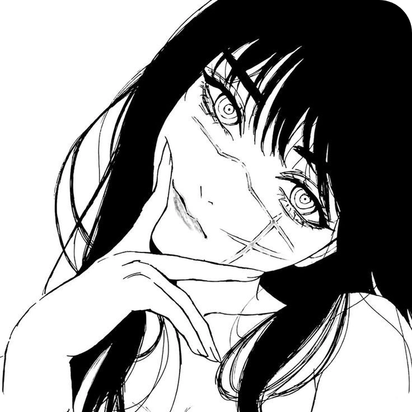
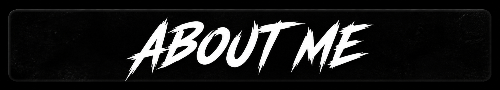
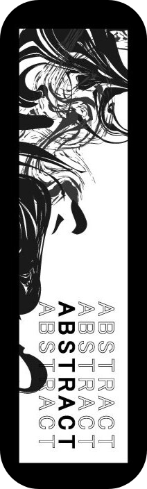
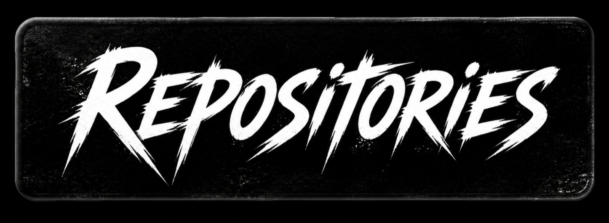

 
 

 
  
- Name: **Ruthvesh Katasani** (You can call me **RisiPlayZz** or **Aqua**)

- A **High School Student** from **India** 🇮🇳  
- Age: **17**

- Good with **Editing**, **Node.js**, **Photography**, **HTML**, **CSS**  
- Familiar with **Windows**, **Mac**, and **KaliLinux**

- Languages: **Hindi**, **English**, **Telugu** , **Tamil**

 
 

 
 
  
- 🧰 [***aquafxx/Aipersona***](https://github.com/aquafxx/Aipersona)  
  A **Character Impersonating AI** with fast setup and simple functions.
- ⚙️ [***aquafxx/VulnerAI***](https://github.com/aquafxx/vulnerAI)  
  A **Vulnerability Testing** designed for automation and customization.
 

  
*“The More You Break, The More You Learn,” – Ruthvesh Katasani*

